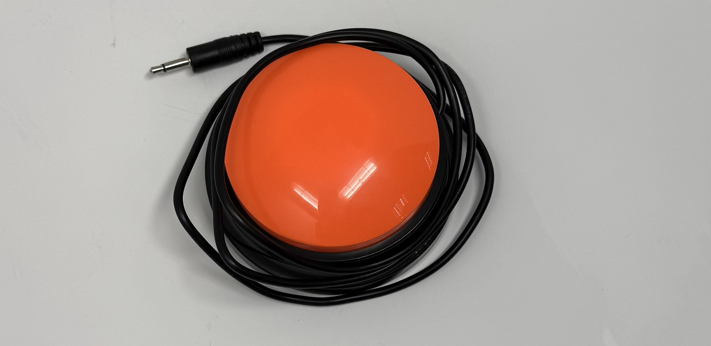

# Adapted Recorder Button 
<!--- TITLE --->
<!--- Open Source Assistive Technology: GitHub Readme Template --->

<!--- SUMMARY --->
The Adapted Recorder Button  is an assistive button that also plays a prerecorded message up to 30 seconds long when the button is pressed. It has a diameter of 80-90mm and an activation force of roughly 250 grams. The Button is made entirely with commercial, off the shelf parts, with no 3D printing involved. It has a similar functionality to the BIGmack and LITTLEmack buttons. This device is intended for users of assistive button who would benefit from or prefer additional audio feedback when using a switch. The device is comprised of off-the-shelf electronics and 3D printed parts. The overall cost of materials is about $8-10 SGD (excluding component shipping fee).

The current version of the device (v1.0) has been built and user tested.

## How to Obtain the Device

### 1. Do-it-Yourself (DIY) or Do-it-Together (DIT)

This is an open-source assistive technology, so anyone is free to build it. All of the files and instructions required to build the device are contained within this repository. Refer to the Maker Guide below.

### 2. Get Involved: Requests & Volunteering

- Need this device? If you or someone you know could benefit from the Adapted Recorder Button, please send us an email at [contactus@engineeringgood.org](contactus@engineeringgood.org). We also invite you to share your journey with us! Tell us your stories about the device and feedback help us make our assistive tech even better!

- Want to help? We are always looking for volunteers to help build these devices for the community. If you have the skills and want to contribute, please contact us via email at [contactus@engineeringgood.org](contactus@engineeringgood.org).

## Build Instructions

### 1. Read through the Maker Guide

The [Maker Guide](/documentation/Product_Manual-Adapted_Recorder_Button.pdf)  contains all the necessary information to build this device, including tool lists, assembly instructions, and testing.

### 2. Order the Off-The-Shelf Components

The [Bill of Materials](/documentation/Adapted_Recorder_Button_BOM.csv) lists all of the parts and components required to build the Adapted Recorder Button.

### 3. Assemble the Adapted Recorder Button

Reference the Assembly Guide section of the [Maker Guide](/documentation/Product_Manual-Adapted_Recorder_Button.pdf) for the tools and steps required to build each portion.

## How to improve this Device

As open source assistive technology, you are welcomed and encouraged to improve upon the design.

## Files

### Documentation

| Document             | Version | Link |
|----------------------|---------|------|
| Maker Guide          | 1.0     | [Adapted_Recorder_Button_Maker_Guide](/documentation/Product_Manual-Adapted_Recorder_Button.pdf")     |
| Bill of Materials    | 1.0     | [Adapted_Recorder_Button_Bill_of_Materials](/documentation/Adapted_Recorder_Button_BOM.csv)     |
| User Guide           | 1.0     | [Adapted_Recorder_Button_User_Guide](/documentation/Product_Manual-Adapted_Recorder_Button.pdf)    |
| Changelog            | 1.0     | [Adapted_Recorder_Button_Chang_Log](/documentation/CHANGES.txt)     |

## Open Hardware Attribution

The core design for this Adapted Recorder Button is based on the Playback Switch, an open-source assistive technology project.
- Original Designer: Makers Making Change (a program of Neil Squire).
- Original Copyright:  Copyright (c) Neil Squire / Makers Making Change.
- Original Source Location: The original project source files are available online at: <https://www.makersmakingchange.com/product/playback-switch/01tJR000003S43lYAC>

## License

Copyright (c) 2024 Neil Squire / Makers Making Change.

This repository describes Open Hardware:

- Everything needed or used to design, make, test, or prepare the Playback Switch is licensed under the [CERN 2.0 Weakly Reciprocal license (CERN-OHL-W v2) or later](https://cern.ch/cern-ohl ).
- All software is under the [GNU General Public License v3.0 (GPL-3.0)](https://www.gnu.org/licenses/gpl.html).
- Accompanying material such as instruction manuals, videos, and other copyrightable works that are useful but not necessary to design, make, test, or prepare the Playback Switch are published under a [Creative Commons Attribution-ShareAlike 4.0 license (CC BY-SA 4.0)](https://creativecommons.org/licenses/by-sa/4.0/).

You may redistribute and modify this documentation and make products using it under the terms of the [CERN-OHL-W v2](https://cern.ch/cern-ohl).
This documentation is distributed WITHOUT ANY EXPRESS OR IMPLIED WARRANTY, INCLUDING OF MERCHANTABILITY, SATISFACTORY QUALITY AND FITNESS FOR A PARTICULAR PURPOSE.
Please see the CERN-OHL-W v2 for applicable conditions.

Source Location: <https://github.com/makersmakingchange/Playback-Switch>

----

<!-- ABOUT EG START -->
## About Engineering Good

- Website: [https://www.engineeringgood.org](https://www.engineeringgood.org)
- GitHub: [Engineering Good](https://github.com/Engineering-Good)
- Instagram: [@engineeringgood](https://www.instagram.com/engineeringgood/)
- Facebook: [engineeringgood](https://www.facebook.com/engineeringgood.org/)
- LinkedIn: [engineeringgood](https://www.linkedin.com/company/engineeringgood/?originalSubdomain=sg)
- Thingiverse: Not Created
- Printables: Not Created

### Contact Us

For technical questions, to get involved, or to share your experience we encourage you to [visit our website](https://www.engineeringgood.org/) or [contact us](https://www.engineeringgood.org/contact-faq/) or email us at [contactus@engineeringgood.org](mailto:contactus@engineeringgood.org).
<!-- ABOUT EG END -->
